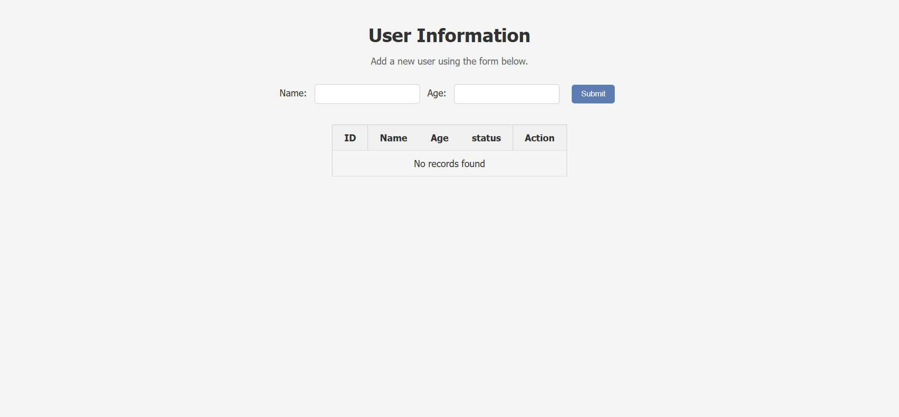
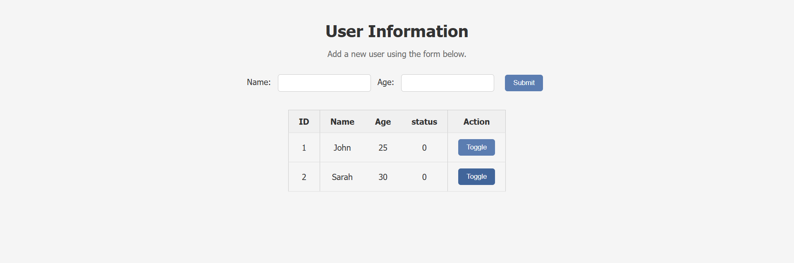
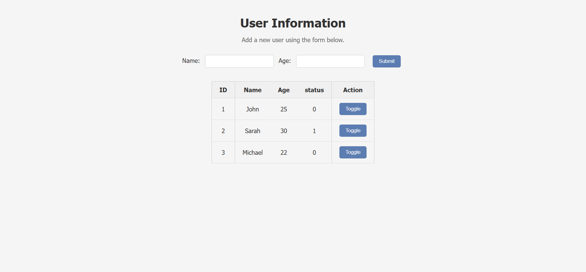

# User Information System

A simple web application developed using HTML, CSS, JavaScript, PHP, and MySQL.  
The project allows adding user information records, storing it in a database, displaying records, and updating the status value dynamically.

## Project Overview

This project was developed to create a webpage connected to a MySQL database.  
The system receives user information through a form, stores it in the database, retrieves the stored records, and allows changing the status value using a Toggle button without reloading the page.

## Project Implementation

### Front-End Development

The user interface was created using:

- **HTML**: Used to build the webpage structure, including the input form and records table.
- **CSS**: Used to style the webpage, form, table, and buttons.
- **JavaScript**: Used to handle dynamic actions, especially updating the status value instantly.

### Database Design

A MySQL database was created to store user information.

A `users` table was created with the following columns:
- `id`: Unique identifier for each record.
- `name`: Stores the user's name.
- `age`: Stores the user's age.
- `status`: Stores the status value (0 or 1).

The database structure was exported into the `mydb.sql` file.

### Database Connection and Data Handling

PHP was used as the backend language to communicate with MySQL.

The `process.php` file handles database operations:

- Receiving submitted form data.
- Inserting new records into the `users` table.
- Updating the status value when the Toggle button is clicked.

The `index.php` file retrieves records from the database using a `SELECT` query and displays them in an HTML table.

### Toggle Functionality

A Toggle button was added for each record.

When the button is clicked:

1. JavaScript sends the selected record ID to `process.php` using Fetch API.
2. PHP updates the status value in the database from `0` to `1` or from `1` to `0`.
3. The updated value is returned to JavaScript.
4. JavaScript updates the status displayed in the table immediately.

## Project Files
- `index.php`: Contains the webpage structure, form, and displays database records.
- `process.php`: Handles database connection, inserting records, and updating status.
- `script.js`: Handles Toggle functionality and updates the webpage dynamically.
- `style.css`: Contains webpage styling.
- `mydb.sql`: Contains the database structure and sample data.

## Application Preview

### Initial Interface

### User Records Before Status Update

### User Records After Status Update

